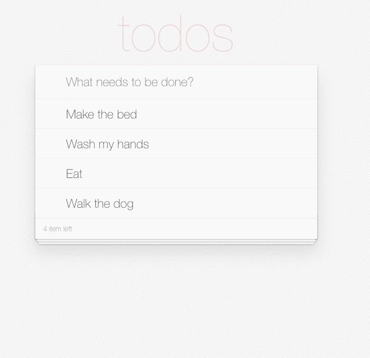

#  Todo list Application Using React

## Allow users to create and delete tasks.

Intermediate exercise. Create a To-Do list app with HTML, CSS and React.

- The tasks are added when the user presses enter on the keyboard, or you can have your own button.
- The delete icon shows only when the task is hovered.
- The user can add as many tasks as they want.
- When there are no tasks the list should say "No tasks, add a task"
- There is no way to update a task, the user will have to delete and create again.

In the end, the project needs to look like this demo:

This exercise is part of the complete 4Geeks Academy course:

- 
